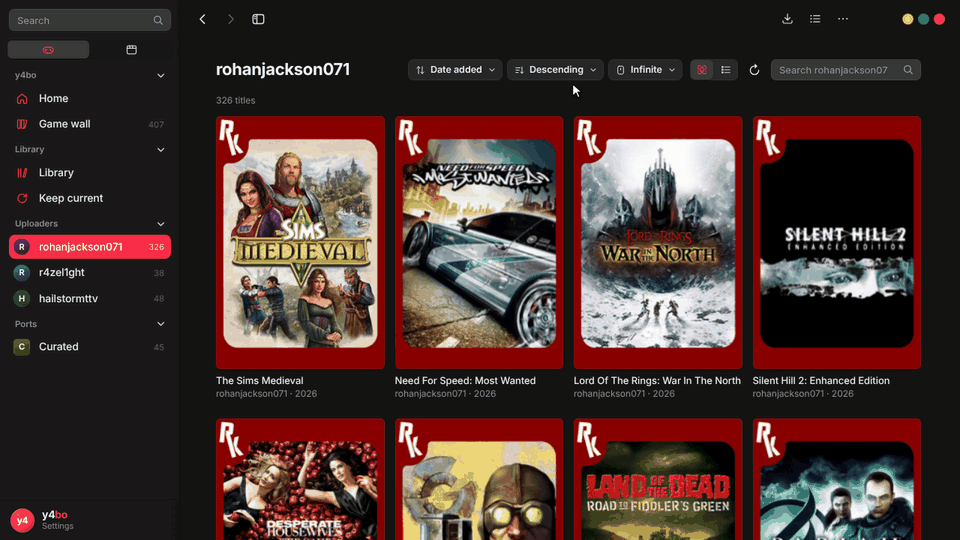

# y4bo

A launcher that downloads and installs games and ports from archive.org and GitHub.
It's a semi-curated list: my picks are built in, and you can add your own.

I made this to test a CI/CD pipeline (see the commit history), not to show what a
proper frontend looks like. **The frontend is vibecoded.**

## What it does

- **archive.org:** browse a few uploaders I trust; one-click download and extract (zip, 7z, rar).
- **GitHub and GitLab:** install release builds of decomp and recomp ports.
- **Add your own:** single archive.org items or GitHub repos in a `user.json`.
  Want a different curated list? Fork it and build your own: [docs/BUILD-YOUR-OWN.md](docs/BUILD-YOUR-OWN.md).
- **Launch:** picks the right exe, or lets you choose when there are several.
- **Add to Steam:** adds an installed game to Steam as a non-Steam shortcut (Big Picture, Steam Deck).
- **Playtime:** tracks how long you've played each game.
- **Uninstall:** moves the game's folder to the Recycle Bin, so it can be undone.
- **Open folder:** opens the install folder, for adding data files, mods or saves by hand.
- **Updates:** the launcher updates itself; installed ports show when a newer release is out.
- **Playnite:** the [RohanKar extension](https://github.com/yabo-san/playnite-extensions/releases?q=rohankar-playnite) puts your library in Playnite.

## Install

Download `y4bo-Setup-x.x.x.exe` from the [latest release](https://github.com/yabo-san/RohanKar-Launcher/releases/latest).
SmartScreen will warn (unsigned): **More info, then Run anyway**.
Verify a download: `gh attestation verify y4bo-Setup-x.x.x.exe --repo yabo-san/RohanKar-Launcher`

## Credits

Fork of the RohanKar Launcher by Kilted-Kraken. Not affiliated with the Internet Archive.
Games belong to their owners and are hosted publicly on archive.org.
